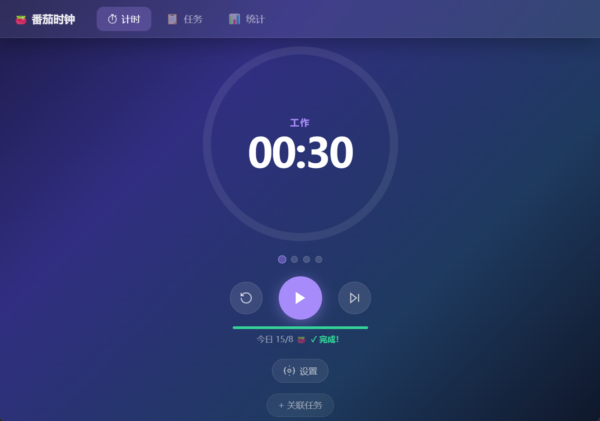
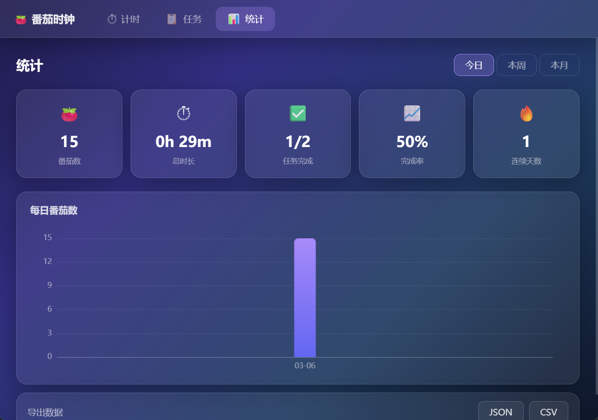
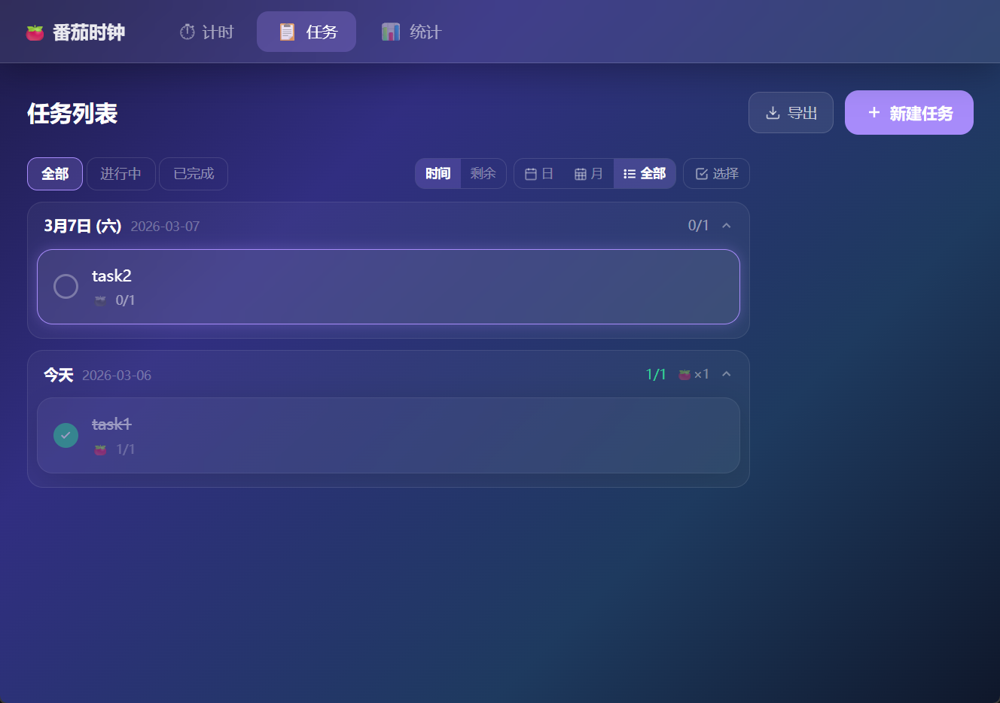
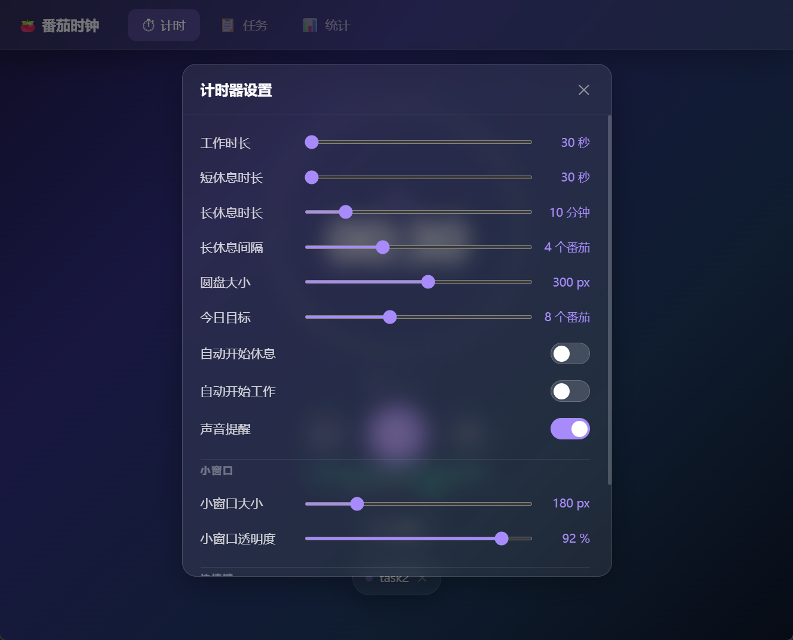
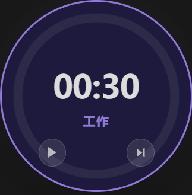

<div align="center">

# 🍅 番茄时钟 · Pomodoro Clock

**A beautiful, feature-rich Pomodoro timer built with Electron + Vue 3**

[](https://github.com/brillian32/pomodoro-app/releases)
[](https://github.com/brillian32/pomodoro-app/releases)
[](LICENSE)
[](https://electronjs.org)
[](https://vuejs.org)

[English](#english) | [中文](#中文)

</div>

---

## English

### 📸 Screenshots

| Timer | Task Calendar | Statistics |
|-------|--------------|------------|
|  |  |  |

| Task List | Settings | Mini Window |
|-----------|----------|-------------|
|  |  |  |

### ✨ Features

#### 🕐 Pomodoro Timer
- Animated **circular progress ring** that fills as time passes — click the ring center to play/pause
- Supports **Work → Short Break → Long Break** automatic cycling
- **4-dot Pomodoro counter** shows progress within the current set
- **Daily goal progress bar** with completion celebration ("✓ 完成!")
- **Quick-link a task** to the current Pomodoro session
- Dedicated **Reset** and **Skip** buttons for full flow control

#### 📋 Task Management
- Multiple view modes: **Timeline**, **Remaining**, **Day**, **Calendar (Month)**, **All**, **Multi-select**
- Tasks grouped by date with per-group completion ratio (e.g., `1/1 🍅×1`)
- Status filters: **All / In Progress / Completed**
- Each task tracks its **planned vs. completed Pomodoro count**
- Create tasks via the "**+ New Task**" button; bulk **Export** to file

#### 📊 Statistics
- **5 summary cards**: Pomodoro count · Total duration · Tasks completed · Completion rate · Streak days
- Time-range switch: **Today / This Week / This Month**
- **Daily Pomodoro bar chart** powered by ECharts 6
- Export productivity data as **JSON** or **CSV**

#### ⚙️ Customizable Settings
| Setting | Description |
|---------|-------------|
| Work Duration | Slider, configurable per session |
| Short / Long Break Duration | Independent sliders |
| Long Break Interval | Number of Pomodoros before a long break |
| Circle Size | Resize the progress ring (px) |
| Daily Goal | Target number of Pomodoros per day |
| Auto-start Break / Work | Toggle to chain sessions automatically |
| Sound Alerts | Toggle beep notification on phase end |
| Mini Window Size | Resize the floating overlay |
| Mini Window Opacity | Adjust transparency (%) |

#### 🪟 Mini Window
- Always-on-top **circular floating overlay** — stays visible over any other app
- Shows current **phase label** and **countdown time**
- **Play/Skip** controls directly on the overlay — no need to switch windows
- Fully **draggable** on screen

#### 🔔 Notifications & Sound
- **System tray notification** pushed when a session ends
- **Web Audio API beep** sound alert (no external audio files required)

#### ⌨️ Keyboard Shortcuts
| Key | Action |
|-----|--------|
| `Space` | Play / Pause |
| `R` | Reset current session |
| `S` | Skip to next phase |
| `Esc` | Close top-most modal |

#### 🎨 UI Design
- **Glassmorphism** dark-mode aesthetic throughout
- Smooth **phase-change flash transition**
- Responsive layout built with **Tailwind CSS 4**

### 📥 Download

Head to the [**Releases**](https://github.com/brillian32/pomodoro-app/releases) page and download the latest installer for your platform.

| Platform | File | Notes |
|----------|------|-------|
| Windows  | `pomodoro-app-x.x.x-setup.exe` | NSIS installer, 64-bit |
| macOS    | `pomodoro-app-x.x.x.dmg` | Universal binary |
| Linux    | `pomodoro-app-x.x.x.AppImage` | Portable |

### 🛠️ Development Setup

**Prerequisites**: Node.js 20+, npm 9+

```bash
# Clone the repository
git clone https://github.com/brillian32/pomodoro-app.git
cd pomodoro-app

# Install dependencies
npm install

# Start in development mode
npm run dev
```

### 🏗️ Build

```bash
# Build for Windows
npm run build:win

# Build for macOS
npm run build:mac

# Build for Linux
npm run build:linux
```

### 🚀 Release a New Version

1. **Bump the version** (choose one):
   ```bash
   npm version patch   # 1.0.0 → 1.0.1  (bug fixes)
   npm version minor   # 1.0.0 → 1.1.0  (new features)
   npm version major   # 1.0.0 → 2.0.0  (breaking changes)
   ```
2. **Push the tag** — this triggers the GitHub Actions release workflow automatically:
   ```bash
   git push --follow-tags
   ```
3. The GitHub Actions workflow will build installers for all platforms and publish them as a GitHub Release.

### 🔧 Tech Stack

| Layer | Technology |
|-------|-----------|
| Desktop runtime | Electron 39 |
| Frontend framework | Vue 3 + Composition API |
| Build tool | electron-vite + Vite 7 |
| State management | Pinia |
| Charts | ECharts 6 + vue-echarts |
| Styling | Tailwind CSS 4 |
| Packaging | electron-builder |

### 🏷️ Versioning

This project follows [Semantic Versioning](https://semver.org/):

- `MAJOR` — Incompatible API or architecture changes
- `MINOR` — New backward-compatible functionality
- `PATCH` — Backward-compatible bug fixes

---

## 中文

### 📸 应用截图

| 计时器 | 任务日历 | 数据统计 |
|--------|---------|---------|
|  |  |  |

| 任务列表 | 设置面板 | 迷你窗口 |
|---------|---------|---------|
|  |  |  |

### ✨ 功能详解

#### 🕐 番茄计时器
- **圆形进度环**随时间流逝自动填充 — 点击圆盘中心即可播放/暂停
- 支持 **工作 → 短休息 → 长休息** 自动轮换
- **4 颗点状番茄计数器**显示当前轮次进度
- **今日目标进度条**，完成后显示「✓ 完成！」庆祝提示
- 可**关联当前任务**到正在进行的番茄
- 独立的**重置**与**跳过**按钮，完整掌控流程

#### 📋 任务管理
- 多种视图模式：**时间**、**剩余**、**白日**、**月历**、**全部**、**多选**
- 任务按日期分组，显示每组完成比（如 `1/1 🍅×1`）
- 状态筛选：**全部 / 进行中 / 已完成**
- 每个任务独立追踪**计划番茄数 vs 完成番茄数**
- 支持「**+ 新建任务**」快速创建，并可一键**批量导出**

#### 📊 数据统计
- **5 张概览卡片**：番茄数 · 总时长 · 任务完成 · 完成率 · 连续天数
- 时间范围切换：**今日 / 本周 / 本月**
- 基于 ECharts 6 的**每日番茄柱状图**
- 支持导出为 **JSON** 或 **CSV** 格式

#### ⚙️ 自定义设置
| 设置项 | 说明 |
|--------|------|
| 工作时长 | 滑块调节，每次会话可单独配置 |
| 短/长休息时长 | 独立滑块分别调整 |
| 长休息间隔 | 多少个番茄后触发长休息 |
| 圆盘大小 | 调整进度环尺寸（px） |
| 今日目标 | 设定每日番茄目标数量 |
| 自动开始休息/工作 | 开关，实现会话无缝衔接 |
| 声音提醒 | 阶段结束时播放提示音 |
| 小窗口大小 | 调整浮窗尺寸 |
| 小窗口透明度 | 调整浮窗不透明度（%） |

#### 🪟 迷你窗口
- 始终置顶的**圆形浮动小窗** — 覆盖在任意应用上方
- 显示当前**阶段名称**与**倒计时**
- 浮窗内直接操作**播放/跳过** — 无需切换主窗口
- 支持在屏幕任意位置**自由拖拽**

#### 🔔 通知与声音
- 会话结束时推送**系统托盘通知**
- 使用 **Web Audio API** 生成提示音（无需外部音频文件）

#### ⌨️ 键盘快捷键
| 按键 | 功能 |
|------|------|
| `空格` | 播放 / 暂停 |
| `R` | 重置当前会话 |
| `S` | 跳过到下一阶段 |
| `Esc` | 关闭最顶层弹窗 |

#### 🎨 界面设计
- 全局**玻璃拟态**深色风格
- 流畅的**阶段切换闪光过渡**动画
- 基于 **Tailwind CSS 4** 的响应式布局

### 📥 下载安装

前往 [**Releases 页面**](https://github.com/brillian32/pomodoro-app/releases) 下载最新版本的安装包。

| 平台 | 文件 | 说明 |
|------|------|------|
| Windows | `pomodoro-app-x.x.x-setup.exe` | NSIS 安装程序，64 位 |
| macOS | `pomodoro-app-x.x.x.dmg` | Universal binary |
| Linux | `pomodoro-app-x.x.x.AppImage` | 免安装便携版 |

### 🛠️ 本地开发

**前置要求**：Node.js 20+，npm 9+

```bash
# 克隆仓库
git clone https://github.com/brillian32/pomodoro-app.git
cd pomodoro-app

# 安装依赖
npm install

# 启动开发模式
npm run dev
```

### 🏗️ 构建打包

```bash
# 构建 Windows 安装包
npm run build:win

# 构建 macOS 安装包
npm run build:mac

# 构建 Linux 安装包
npm run build:linux
```

### 🚀 发布新版本

1. **升级版本号**（任选其一）：
   ```bash
   npm version patch   # 1.0.0 → 1.0.1  （Bug 修复）
   npm version minor   # 1.0.0 → 1.1.0  （新功能）
   npm version major   # 1.0.0 → 2.0.0  （重大变更）
   ```
2. **推送 tag** — 这会自动触发 GitHub Actions 构建并发布 Release：
   ```bash
   git push --follow-tags
   ```
3. GitHub Actions 工作流将自动为各平台构建安装包，并发布为 GitHub Release。

### 🏷️ 版本规划

本项目遵循 [语义化版本](https://semver.org/lang/zh-CN/)：

- `MAJOR`（主版本）— 不兼容的架构变更
- `MINOR`（次版本）— 向后兼容的新功能
- `PATCH`（补丁版）— 向后兼容的 Bug 修复

### 🔧 推荐开发环境

[VSCode](https://code.visualstudio.com/) + [ESLint](https://marketplace.visualstudio.com/items?itemName=dbaeumer.vscode-eslint) + [Prettier](https://marketplace.visualstudio.com/items?itemName=esbenp.prettier-vscode) + [Volar](https://marketplace.visualstudio.com/items?itemName=Vue.volar)

---

<div align="center">

Made with ❤️ using Electron + Vue 3

</div>
